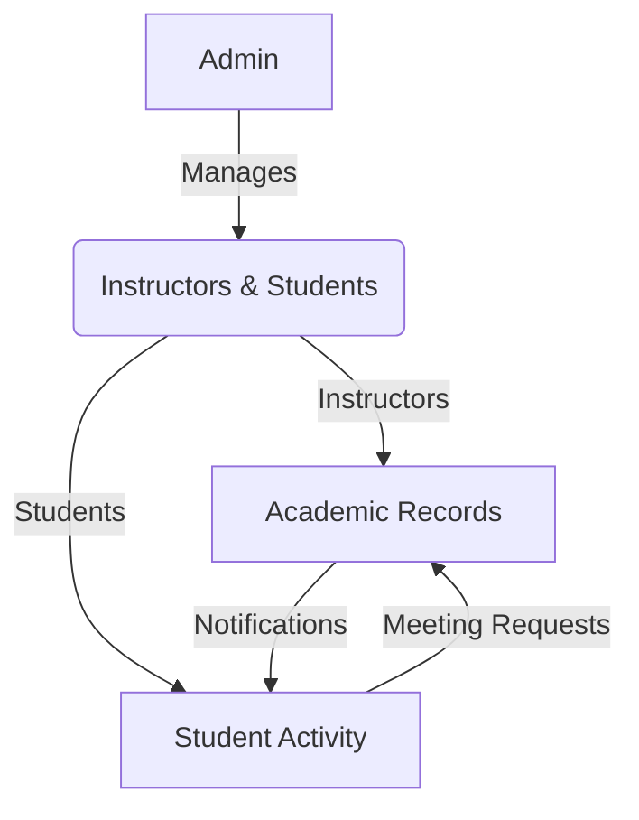

# Eduflow | Smart Academic Management System

A Full-Stack Academic Management System built to digitize university operations. The project focuses on handling complex roles (Admin, Doctor, Student) and automating campus workflows like attendance and scheduling.

##  Tech Stack
* **Frontend:** React.js, Redux Toolkit, Bootstrap, Custom CSS.
* **Backend:** ASP.NET Core Web API, JWT Authentication.
* **Data Access:** **ADO.NET** (Manual Mapping & Optimized SQL Queries)
* **Database:** MS SQL Server.

##  Key Modules & Logic

### 1. Admin Control
* **RBAC:** Secure dashboards for Admin, Doctors, and Students.
* **User Management:** Centralized creation and auditing of all user accounts.
* **Insights:** Real-time stats on user population and daily lecture activity.

### 2. Instructor Workflow
* **Hybrid Attendance:** Student check-ins via **Manual Toggle** or **QR Code**.
* **Smart Warnings:** Automated flagging for students exceeding absence limits.
* **Gradebook:** Digital recording of grades with custom behavioral notes.
  
### 3. Student Experience
*   **Enrollment:** Dynamic course registration and visual schedule builder.
*   **Presence Validation (Basic):** Simple **Check-in** button.
*   **Presence Validation (Advanced):** **QR Scanning** + **Geolocation** for campus-only attendance.
*   **Tracking:** Live monitoring of grades, warnings, and doctor appointments.

##  System Workflow (Business Logic)

## 🔧 Installation & Setup
1. Clone the repo: `git clone https://github.com/Toqa-Ashraf8/EduFlow-System.git`
2. **Backend:** - Update `appsettings.json` with your SQL connection string.ٍ
   - Run `dotnet ef database update`.
   - Run `dotnet run`.
3. **Frontend:** - Run `npm install`.
   - Run `npm start`.
